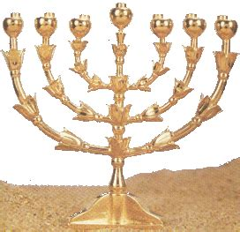
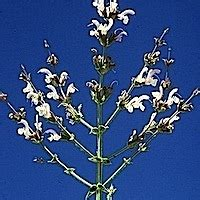

# Menorah

## Images

## References
+ https://en.wikipedia.org/wiki/Menorah_(Temple)

## Anatomical Details

<iframe
  id="embedded-human"
  frameBorder="0"
  width="700"
  height="550"
  allowFullScreen="true"
  src="https://human.biodigital.com/viewer/?be=3X5n&ui-info=true&ui-search=true&ui-reset=true&ui-fullscreen=true&ui-nav=true&ui-tools=true&ui-help=true&ui-chapter-list=false&ui-label-list=true&ui-anatomy-descriptions=false&ui-tutorial=false&disable-scroll=false&camera=-2.287,166.999,-31.862,-1.436,159.779,2.606,0.007,0.958,0.287&uaid=5eB51">
</iframe>

## Table of Correspondence

|  **Dimensions** | **Human Body** | **Temple's Menorah** |
| --- | --- | --- |
|  Anatomical location | Head | Head of God  Nourishment-ingesting organ |
|  Main nourishing gate | Lips | Middle Lamp |
|  Secondary nourishing gates | Nostrils | 2 Lamps adjacent to the middle |
|  Tertiary nourishing gates | Lower lacrimal ducts | 2 Lamps distally-adjacent to the previous |
|  Quaternary nourishing gates | Higher lacrimal ducts | 2 Lamps distally-adjacent to the previous |
|  Importance | The human gains vitality by eating and breathing | The Roman-Jewish historian Flavius Josephus  states that three of the seven lamps  were allowed to burn during the day also |
|  Fuel of God: nature | Humans consume solid, liquid and gas | God consumes plasma (korban olah/holocaust) |
|  Fuel of God: liquid-like | The unrestricted flow of liquid has a curved trajectory | The arms are curved, fire mimics plasma |
|  Flow | The buccal cavity, nostrils,  lacrimal ducts flow into the esophagus | The arms are attached to the middle arm |
|  Dimensional folding 1 | From multiple ducts into 1 duct | From multiple arms into 1 arm |
|  Dimensional folding 2 |  | From 1 arm to 1 point |

## Hypotheses
